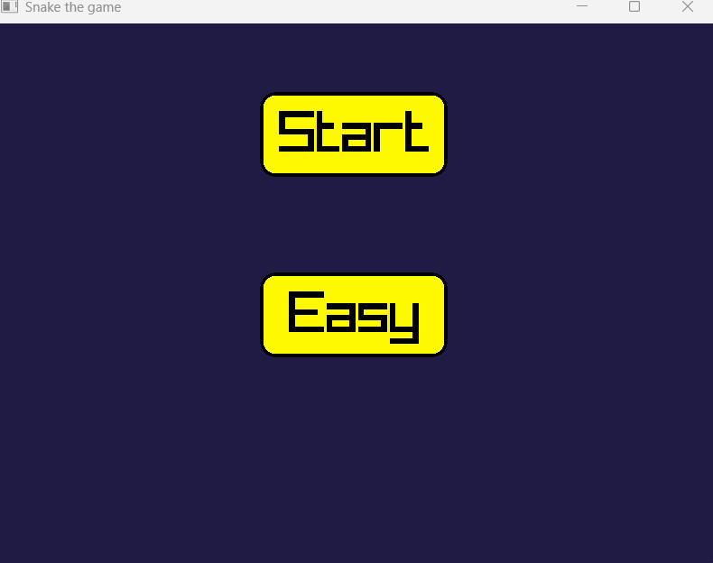

# Snake Game

Snake game in C++ using Raylib. Adaptive to screen resolution and very bug-resistant.

## Features
- Animated grid appearence
- Food generation
- Wall logic
- Easy to manual change levels
- Victory detection
- Written in modern C++
- Could be run on potato

## Build
- Requires [Raylib](https://www.raylib.com/)
- Built with Visual Studio 2022 v17.12.3

## Demo

## License
MIT
